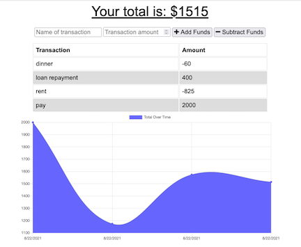

# Budget Tracker

## Description

The Budget Tracker is an application that can be used to track your expenses and income with a simple graph displaying the ending balance. This application uses IndexedDB for offline fucntionality and is set up as a PWA (progressive web app) for users to install on a mobile device.

## Table of Contents

* [Usage](#usage)
* [Deployed App](#deployed-app)
* [Questions](#questions)
* [License](#license)

## Usage

If you'd like to use the source code, clone the repository and use the command `npm install` to load the necessary dependencies. From there use `npm start` to load the server locally. 

## Deployed App

This application has been deployed through Heroku, try it out [here](https://stormy-earth-47988.herokuapp.com/).

## Questions

If you have questions about this project please contact me at [crawleyj2@gmail.com](mailto:crawleyj2@gmail.com).
More of my work can be found on GitHub at [crawleyj2](https://github.com/crawleyj2)

## License

MIT License

Copyright (c) 2021 James Crawley

Permission is hereby granted, free of charge, to any person obtaining a copy
of this software and associated documentation files (the "Software"), to deal
in the Software without restriction, including without limitation the rights
to use, copy, modify, merge, publish, distribute, sublicense, and/or sell
copies of the Software, and to permit persons to whom the Software is
furnished to do so, subject to the following conditions:

The above copyright notice and this permission notice shall be included in all
copies or substantial portions of the Software.

THE SOFTWARE IS PROVIDED "AS IS", WITHOUT WARRANTY OF ANY KIND, EXPRESS OR
IMPLIED, INCLUDING BUT NOT LIMITED TO THE WARRANTIES OF MERCHANTABILITY,
FITNESS FOR A PARTICULAR PURPOSE AND NONINFRINGEMENT. IN NO EVENT SHALL THE
AUTHORS OR COPYRIGHT HOLDERS BE LIABLE FOR ANY CLAIM, DAMAGES OR OTHER
LIABILITY, WHETHER IN AN ACTION OF CONTRACT, TORT OR OTHERWISE, ARISING FROM,
OUT OF OR IN CONNECTION WITH THE SOFTWARE OR THE USE OR OTHER DEALINGS IN THE
SOFTWARE.